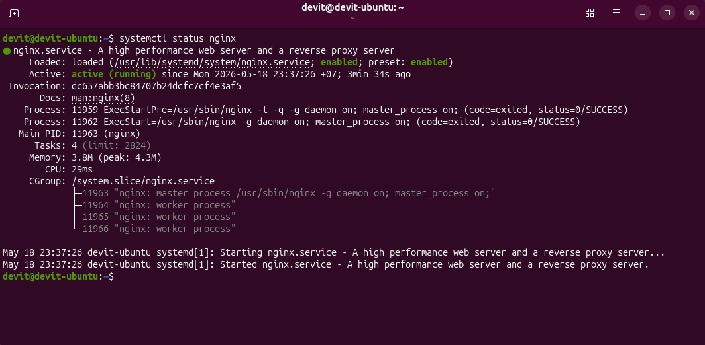
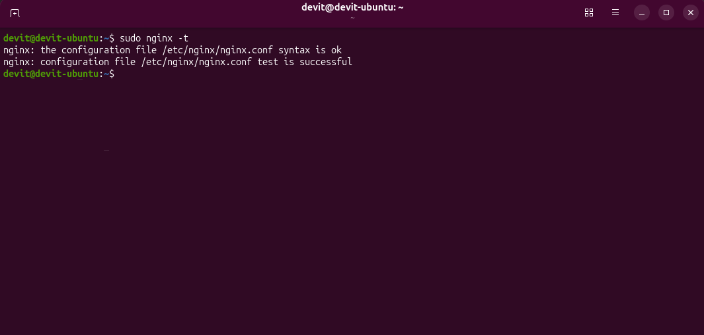
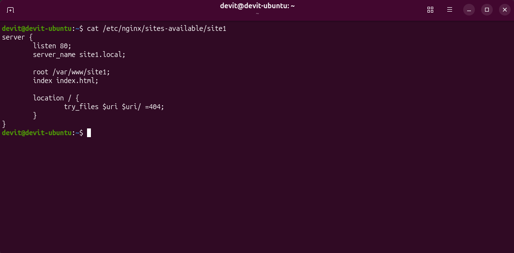

# Nginx Virtual Hosts Lab (Ubuntu Linux)

This project demonstrates how to configure Nginx virtual hosts (server blocks) on Ubuntu Linux.

It shows how multiple websites can be hosted on a single server using different domain names resolved via the hosts file.

This setup simulates real-world hosting environments used in web hosting and system administration.

---

##  Tech Stack

- Ubuntu Linux
- Nginx Web Server
- Local DNS (hosts file)
- HTML

---

##  Goal

Configure multiple websites on a single Nginx server using server_name directives and verify correct routing between them.

---

##  Features

- Nginx installation and configuration
- Multiple virtual hosts (server blocks)
- Local domain simulation via /etc/hosts
- Service management and validation
- Configuration testing with nginx -t

---

##  Screenshots

### 1. Nginx service status
Shows that Nginx is running.

---

### 2. Nginx configuration test
Verification of correct configuration.

---

### 3. Site 1 working
First virtual host response.

---

### 4. Site 2 working
Second virtual host response.

---

### 5. Site 1 configuration
Nginx server block for site1.local.

---

### 6. Site 2 configuration
Nginx server block for site2.local.

##  What I learned

- How Nginx server blocks work
- Virtual hosting on a single IP
- Domain routing using server_name
- Linux service management (systemd)
- Configuration validation using nginx -t
